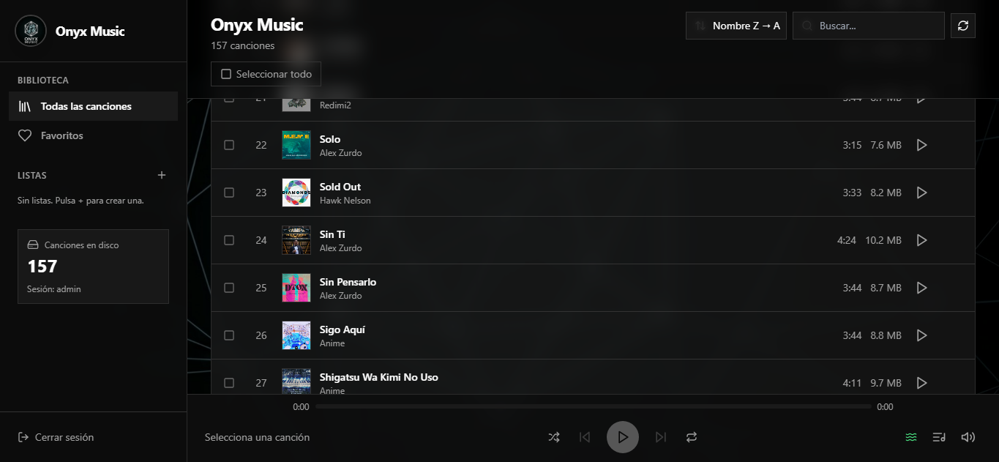

# Onyx Music Player

Reproductor de música web autoalojado: interfaz oscura minimalista, biblioteca local, listas, favoritos, cola, shuffle y PWA.


## Estructura del proyecto

```
onyx-music-player/
├── backend/                 # API Go (Fiber)
│   ├── main.go              # Rutas y servidor
│   ├── auth.go              # Login JWT
│   ├── library.go           # Escaneo y caché de biblioteca
│   ├── duration.go          # Duración MP3 rápida
│   └── Dockerfile
├── frontend/                # React + Nginx
│   ├── src/
│   ├── public/assets/       # logo, fondo, iconos PWA
│   └── Dockerfile
├── deploy/
│   └── openmediavault/      # Stack Docker para OMV / NAS
│       ├── docker-compose.yml
│       ├── .env.example
│       └── README.md
├── music/                   # Tu biblioteca (no se sube a Git)
├── docker-compose.yml       # Despliegue estándar
├── .env.example
└── README.md
```

## Inicio rápido (Docker)

### 1. Configuración

```bash
cp .env.example .env
# Edita .env: contraseña, JWT_SECRET, etc.
```

### 2. Música

Coloca archivos en `music/` (`.mp3`, `.flac`, `.wav`, `.ogg`, `.m4a`, `.aac`).

Nombres tipo `Artista - Título.mp3` se interpretan automáticamente.

### 3. Arrancar

```bash
docker compose up -d --build
```

### 4. Acceso

| URL | Descripción |
|-----|-------------|
| http://localhost:4000 | Aplicación web |
| http://localhost:4000/api/... | API (proxy por Nginx) |

**Login por defecto** (cámbialo en `.env`): `admin` / `onyx123`

## OpenMediaVault (NAS)

Guía detallada: **[deploy/openmediavault/README.md](deploy/openmediavault/README.md)**

Resumen:

1. Clona el repo en el NAS (ej. `/opt/onyx-music-player`).
2. `cp deploy/openmediavault/.env.example deploy/openmediavault/.env`
3. Define `MUSIC_PATH` con la ruta absoluta de tu carpeta de música en OMV.
4. En OMV → **Docker → Compose** → crea el proyecto apuntando a `deploy/openmediavault`.
5. Abre `http://IP-DEL-NAS:4000`.

Solo se publica un puerto; la API va por proxy interno (funciona desde cualquier dispositivo en la red).

## Desarrollo local

### Backend

```bash
cd backend
go mod tidy
# Windows
set PORT=9090
set MUSIC_DIR=../music
go run .
```

### Frontend

```bash
cd frontend
cp .env.example .env
npm install
npm start
```

Abre http://localhost:4000 — el proxy de `package.json` redirige `/api` al backend.

## Variables de entorno

| Variable | Por defecto | Descripción |
|----------|-------------|-------------|
| `MUSIC_PATH` | `./music` | Carpeta de audio en el host |
| `FRONTEND_PORT` | `4000` | Puerto HTTP de la app |
| `PORT` | `9090` | Puerto interno del backend |
| `ONYX_USER` | `admin` | Usuario de login |
| `ONYX_PASSWORD` | — | Contraseña (**obligatorio cambiar**) |
| `JWT_SECRET` | — | Secreto JWT (**obligatorio cambiar**) |
| `REACT_APP_API_URL` | *(vacío)* | Vacío = proxy `/api` en Docker |

## Subir a Git

```bash
git init
git add .
git status   # revisa que no aparezcan .env ni music/*.mp3
git commit -m "Initial commit: Onyx Music Player"
git remote add origin https://github.com/TU_USUARIO/onyx-music-player.git
git branch -M main
git push -u origin main
```

**No subas:** `.env`, archivos de `music/`, `node_modules/`, `frontend/build/`.

## API principal

| Método | Ruta | Descripción |
|--------|------|-------------|
| POST | `/api/auth/login` | Iniciar sesión |
| GET | `/api/songs` | Lista de canciones (requiere token) |
| GET | `/api/stream/*` | Streaming de audio |
| GET | `/api/cover/*` | Carátula embebida |
| GET | `/health` | Estado del servidor |

## Atajos de teclado

| Tecla | Acción |
|-------|--------|
| Espacio | Play / Pausa |
| → | Siguiente |
| ← | Anterior / reiniciar |

## Licencia

Uso personal y autoalojado. Ajusta credenciales y `JWT_SECRET` antes de exponer en internet.
